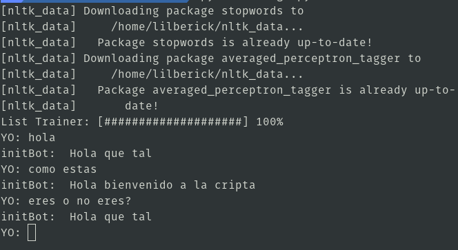
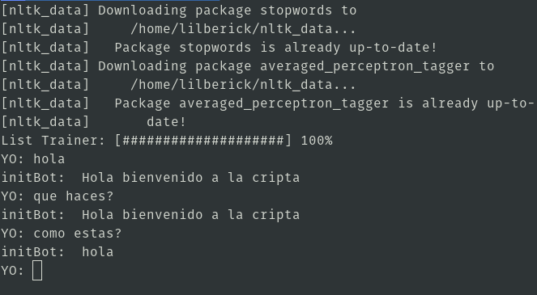

# ChatterBot
> **[Click aqui para ver la documentación](https://chatterbot.readthedocs.io/en/stable/)**


## Instalación
```
$ pip3 install chatterbot
$ pip3 install chatterbot-corpus
```
## Ejemplos
1. Respuestas automáticas
	```
	from chatterbot import ChatBot
	from chatterbot.trainers import ChatterBotCorpusTrainer
	chatbot = ChatBot('InitBot')
	entrenador = ChatterBotCorpusTrainer(chatbot)
	entrenador.train('chatterbot.corpus.spanish')
	while True:
	    solicitud = input('YO: ')
	    respuesta = chatbot.get_response(solicitud)
	    print('initBot: ', respuesta)
	```
	
2. Respuestas determinadas
	```
	from chatterbot import ChatBot
	from chatterbot.trainers import ListTrainer
	chatbot = ChatBot('InitBot')
	chatbot.storage.drop()
	conversaction = ["Hola que tal","Hola bienvenido a la cripta"]
	entrenador = ListTrainer(chatbot)
	entrenador.train(conversaction)
	while True:
	    solicitud = input('YO: ')
	    respuesta = chatbot.get_response(solicitud)
	    print('initBot: ', respuesta)
	```
	
