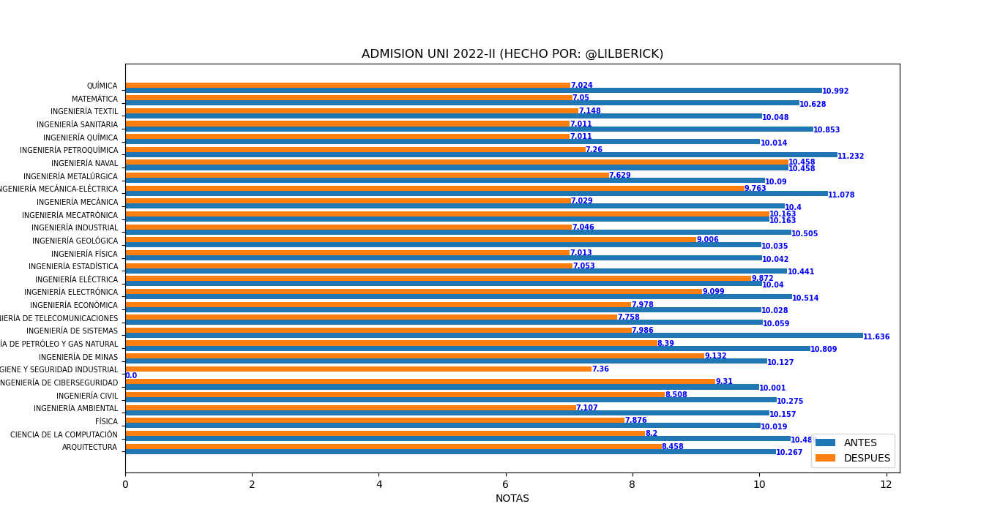
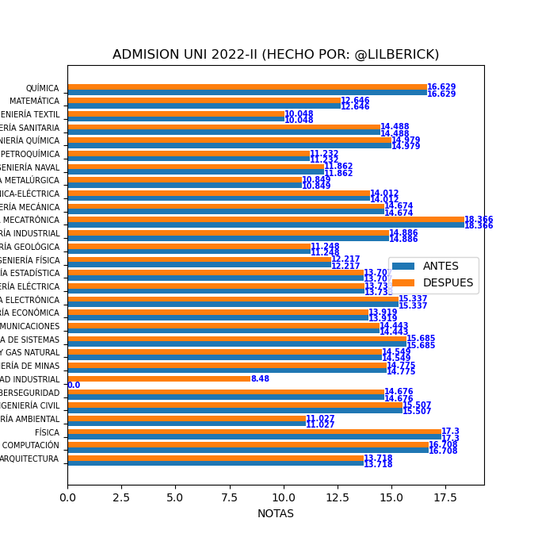
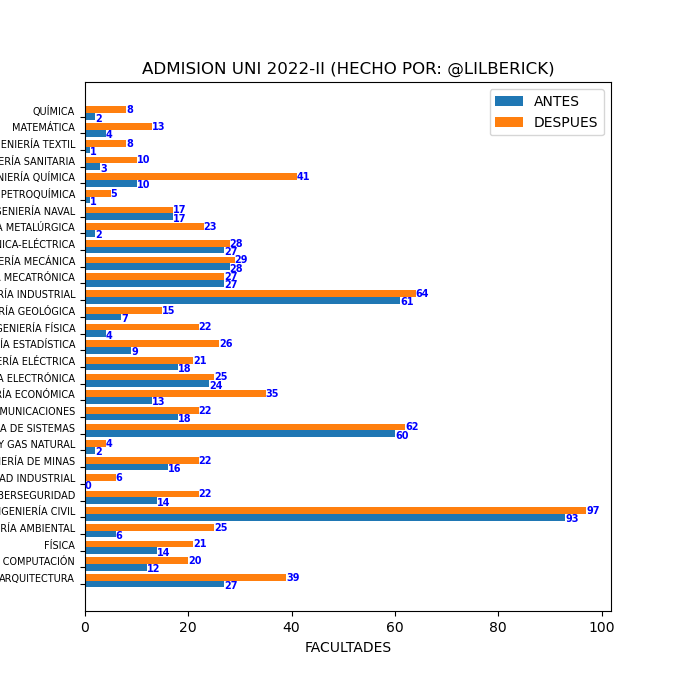
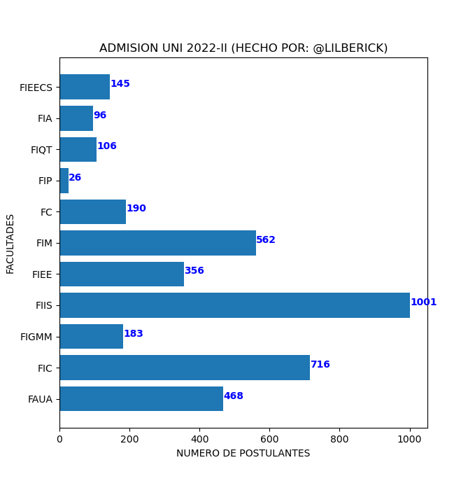
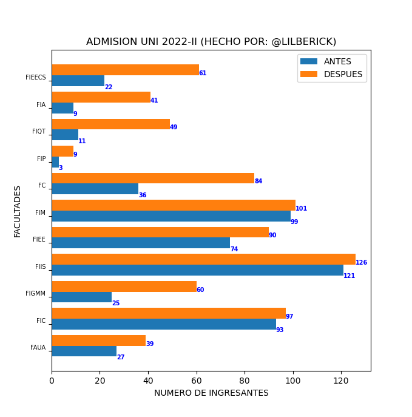

# [ADMISION UNI 2022-II](http://www.admision.uni.edu.pe/)

## DATA: 

* **ANTES**: a.csv (2022-08-22)
* **DESPUES**: b.csv (2022-08-23)


## `codigo.py`

```py
import matplotlib.pyplot as plt
import csv
import numpy as np
m={"FAUA":0,"FIC":0,"FIGMM":0,"FIIS":0,"FIEE":0,"FIM":0,"FC":0,"FIP":0,"FIQT":0,"FIA":0,"FIEECS":0}
def Graficar1(x,y,xlabel,ylabel,title):
    plt.xlabel(xlabel)
    plt.ylabel(ylabel)
    plt.title(title)
    plt.barh(x,y)
    for i, v in enumerate(y):plt.text(v, i,str(v),color='blue',fontweight='bold')
    plt.show()
def Graficar2(x,y,z,xlabel,ylabel,title,labely,labelz):
    x_axis=np.arange(len(x))
    plt.barh(x_axis-0.2,y,0.4,label=labely,align="edge")
    plt.barh(x_axis+0.2,z,0.4,label=labelz,align="edge")
    plt.yticks(range(len(x)),x,size="small",fontsize=7,va="bottom",ha="right")
    plt.xlabel(xlabel)
    plt.ylabel(ylabel)
    plt.title(title)
    plt.legend()
    for i, v in enumerate(y):plt.text(v, i-0.3, str(v), color='blue', fontweight='bold',size=7)
    for i, v in enumerate(z):plt.text(v, i+0.2, str(v), color='blue', fontweight='bold',size=7)
    plt.show()
def TotalPostulantesFacultad(**m):
    with open('b.csv','r') as csvfile:
        plots = csv.reader(csvfile, delimiter = ',')
        for row in plots: m[row[4]]=m.get(row[4],0)+1
    x,y=[i for i in m],[m[i] for i in m]
    for i in range(len(x)):print(x[i],y[i])
    xlabel,ylabel,title="NUMERO DE POSTULANTES","FACULTADES","ADMISION UNI 2022-II (HECHO POR: @LILBERICK)"
    Graficar1(x,y,xlabel,ylabel,title)
def TotalIngresantesFacultad(**m):
    with open('a.csv','r') as csvfile:
        plots=csv.reader(csvfile, delimiter = ',')
        for row in plots:
            if(row[3][:17]=="ALCANZÓ VACANTE A"):
                m[row[4]]=m.get(row[4],0)+1
    y=[m[i] for i in m]
    m={"FAUA":0,"FIC":0,"FIGMM":0,"FIIS":0,"FIEE":0,"FIM":0,"FC":0,"FIP":0,"FIQT":0,"FIA":0,"FIEECS":0}
    with open('b.csv','r') as csvfile:
        plots=csv.reader(csvfile, delimiter = ',')
        for row in plots:
            if(row[3][:17]=="ALCANZÓ VACANTE A"):
                m[row[4]]=m.get(row[4],0)+1
    x=[i for i in m]
    z=[m[i] for i in m]
    for i in range(len(x)):print(x[i],y[i],z[i])
    xlabel,ylabel,title,labely,labelz="NUMERO DE INGRESANTES","FACULTADES","ADMISION UNI 2022-II (HECHO POR: @LILBERICK)","ANTES","DESPUES"
    Graficar2(x,y,z,xlabel,ylabel,title,labely,labelz)
def TotalIngresantesCarreras():
    m={"INGENIERÍA DE HIGIENE Y SEGURIDAD INDUSTRIAL":0}
    with open('a.csv','r') as csvfile:
        plots=csv.reader(csvfile, delimiter = ',')
        for row in plots:
            if(row[3][:17]=="ALCANZÓ VACANTE A"):
                m[row[3][19:]]=m.get(row[3][19:],0)+1
    m=dict(sorted(m.items()))
    x=[i for i in m]
    y=[m[i] for i in m]
    m={}
    with open('b.csv','r') as csvfile:
        plots=csv.reader(csvfile, delimiter = ',')
        for row in plots:
            if(row[3][:17]=="ALCANZÓ VACANTE A"):
                m[row[3][19:]]=m.get(row[3][19:],0)+1
    m=dict(sorted(m.items()))
    z=[m[i] for i in m]
    xlabel,ylabel,title,labely,labelz="FACULTADES","NUMERO DE INGRESANTES","ADMISION UNI 2022-II (HECHO POR: @LILBERICK)","ANTES","DESPUES"
    for (i,j,k) in zip(x,y,z):
        print(i,j,k)
    Graficar2(x,y,z,xlabel,ylabel,title,labely,labelz)
def Inicializar(filecsv,valor):
    m={"INGENIERÍA DE HIGIENE Y SEGURIDAD INDUSTRIAL":valor}
    with open(filecsv,'r') as csvfile:
        plots=csv.reader(csvfile, delimiter = ',')
        for row in plots:
            if(row[3][:17]=="ALCANZÓ VACANTE A"):
                m[row[3][19:]]=valor
    return m
def MinimosMaximos(filecsv,m_min,m_max):
    with open(filecsv,'r') as csvfile:
        plots=csv.reader(csvfile, delimiter = ',')
        for row in plots:
            if(row[3][:17]=="ALCANZÓ VACANTE A"):
                m_min[row[3][19:]]=min(float(row[2]),m_min[row[3][19:]])
                m_max[row[3][19:]]=max(float(row[2]),m_max[row[3][19:]])
    m_min=dict(sorted(m_min.items()))
    m_max=dict(sorted(m_max.items()))
    m={}
    for (i,j) in zip(m_min,m_max):
        m[i]=str("%.3f" % m_min[i])+"-"+str("%.3f" % m_max[j])
    return m
def MinimosMaximosCarreras():
    xlabel,ylabel,title,labely,labelz="NOTAS","FACULTADES","ADMISION UNI 2022-II (HECHO POR: @LILBERICK)","ANTES","DESPUES"
    #ANTES DEL DESASTRE
    m_min,m_max,m=Inicializar("a.csv",30),Inicializar("a.csv",0),{}
    m_min["INGENIERÍA DE HIGIENE Y SEGURIDAD INDUSTRIAL"]=0
    m=MinimosMaximos("a.csv",m_min,m_max)
    x=[i for i in m]
    ymin=[float(m[i].split('-')[0]) for i in m]
    ymax=[float(m[i].split('-')[1]) for i in m]
    #DESPUES DEL DESASTRE
    m_min,m_max,m=Inicializar("b.csv",30),Inicializar("b.csv",0),{}
    m=MinimosMaximos("b.csv",m_min,m_max)
    zmin=[float(m[i].split('-')[0]) for i in m]
    zmax=[float(m[i].split('-')[1]) for i in m]
    #MINIMOS
    for i in range(len(x)):print("MINIMO: ",x[i],ymin[i],zmin[i])
    Graficar2(x,ymin,zmin,xlabel,ylabel,title,labely,labelz)
    #MAXIMOS
    for i in range(len(x)):print("MAXIMO: ",x[i],ymax[i],zmax[i])
    Graficar2(x,ymax,zmax,xlabel,ylabel,title,labely,labelz)
#MinimosMaximosCarreras()
#TotalIngresantesCarreras()
#TotalPostulantesFacultad()
TotalIngresantesFacultad()
```

## Resultado

1. Puntajes

	* Mínimos

		

	* Máximos

		

2. Total ingresantes carreras

	

3. Total postulantes por facultad

	

4. Total ingresantes por facultad

	

# Obervación: [Resultados](http://resultados.admision.uni.edu.pe/) ya no disponible


