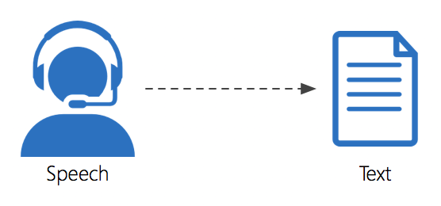
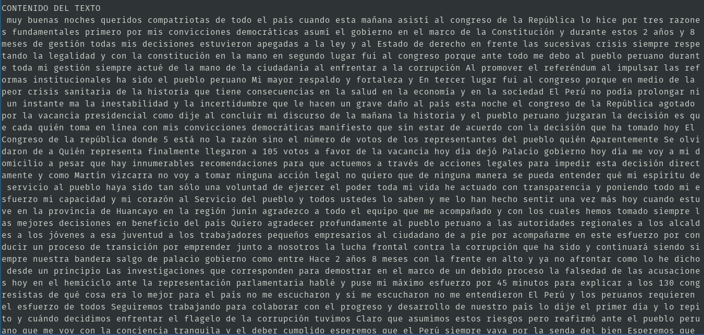
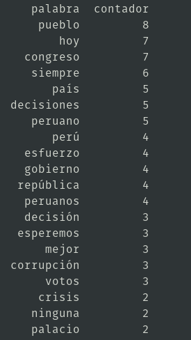
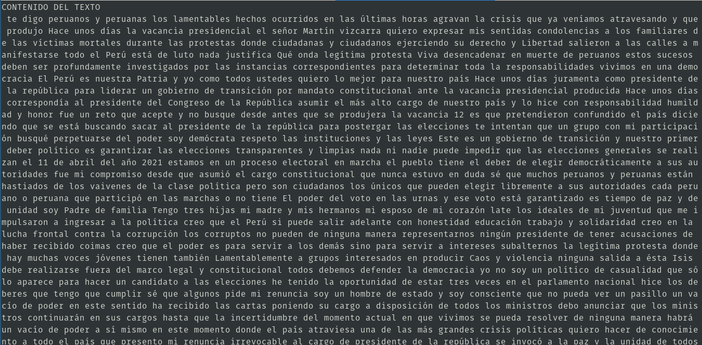
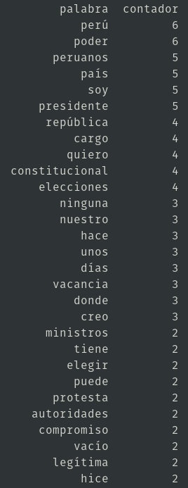
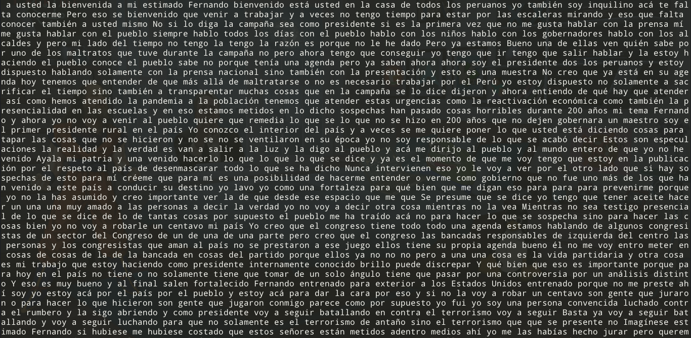
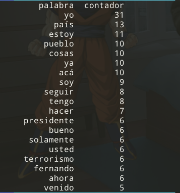

# Speech Recognition

[Click aquí para ir a la documentación original](https://pypi.org/project/SpeechRecognition/)



## Instalación (usando un entorno virtual)  

```sh
$ pipenv install pyaudio
$ pipenv install SpeechRecognition
```

## Ejemplos en Python

1. Audio a texto (audio en ingles) (usar audio .wav)

	```python
	import speech_recognition as sr
	r = sr.Recognizer()
	harvard = sr.AudioFile('test.wav')
	with harvard as source:
	    audio = r.record(source)
	print("YOU SAID: " + r.recognize_google(audio))
	```

2. Audio a texto (idioma spanish) (usar audio .wav)

	```python
	import speech_recognition as sr
	r = sr.Recognizer()
	with sr.AudioFile('hola.wav') as source:
	    audio = r.record(source)
	print("YOU SAID: " + r.recognize_google(audio,language='es-PE'))
	```

3. Archivo de audio a texto (audio en inglés) (usar audio .wav)

	```python
	import speech_recognition as sr
	r = sr.Recognizer()
	audio='test.flac'
	with sr.AudioFile(audio) as source:
	    print ('Say Something!')
	    audio = r.record(source)
	    print ('Done!')
	try:    
		text = r.recognize_google(audio)
		print (text)
	except Exception as e:
		print (e)
	```

4. Micrófono a texto (hablar en inglés)

	```python
	import speech_recognition as sr
	# get audio from the microphone
	r = sr.Recognizer()
	with sr.Microphone() as source:
	    print("Speak:")
	    audio = r.listen(source)
	try:
	    print("You said " + r.recognize_google(audio))
	except sr.UnknownValueError:
	    print("Could not understand audio")
	except sr.RequestError as e:
	    print("Could not request results; {0}".format(e))
	```

5. Micrófono a texto (hablar en español)

	```python
	import speech_recognition as sr
	# get audio from the microphone
	r = sr.Recognizer()
	with sr.Microphone() as source:
	    print("Speak:")
	    audio = r.listen(source)
	try:
	    print("You said " + r.recognize_google(audio,language='es-PE'))
	except sr.UnknownValueError:
	    print("Could not understand audio")
	except sr.RequestError as e:
	    print("Could not request results; {0}".format(e))
	```

## Conteo de palabras: Discurso de la vacancia del Presidente Vizcarra

1. Input: [VacanciaVizcarra.wav](.img/VacanciaVizcarra.wav)

2. `codigo.py`

	```py
	import os
	os.system('/usr/bin/ffmpeg -i VacanciaVizcarra.wav -c copy -map 0 -segment_time 00:05:00 -f segment output%03d.wav')
	import glob
	print(glob.glob("output*.wav"))
	a=glob.glob("output*.wav")
	texto=''
	for i in range(len(a)):
	    print(a[i])
	    #audio_to_text():
	    import speech_recognition as sr
	    r = sr.Recognizer()
	    audio=a[i]
	    with sr.AudioFile(audio) as source:
		audio = r.record(source)
		print('Done!')
	    try:    
		text = r.recognize_google(audio,language='es-PE')
	    except Exception as e:
		print(e)
	    texto=texto+" "+text

	print("CONTENIDO DEL TEXTO")
	print(texto)
	#Conteo de palabras
	contadores = dict()
	texto = texto.replace(',','').replace('.','').replace('?','').lower()
	palabras = texto.split()
	for palabra in palabras:
	    contadores[palabra]=contadores.get(palabra,0)+1

	remover= ('para', 'todo','sido','como','quién','ante','esta','de','del','la','y','el','en','a','que','mi','mis','al','los','lo','con','por','me','las','un','una','ha','han','se','si','no','voy','día','son','toda','o','muy','todos','qué','fui','he','cuando','estos','su','más','es','sus','nos','este','pero','le','ser','eso','solo','aqui','otros','aquí','están','está','entre','fue')
	for k in remover:
	    contadores.pop(k, None)

	import pandas
	b=pandas.DataFrame(list(contadores.items()),columns=['palabra','contador']).sort_values('contador',ascending=False)
	print(b.head(30))
	```

3. Output  

	  

	    

## Conteo de palabras: Discurso de la renuncia del Presidente Merino

1. Input: [RenunciaMerino.wav](.img/RenunciaMerino.wav)

2. `codigo.py`

	```py
	import os
	os.system('/usr/bin/ffmpeg -i RenunciaMerino.wav -c copy -map 0 -segment_time 00:05:00 -f segment output%03d.wav')
	import glob
	print(glob.glob("output*.wav"))
	a=glob.glob("output*.wav")
	texto=''
	for i in range(len(a)):
	    print(a[i])
	    #audio_to_text():
	    import speech_recognition as sr
	    r = sr.Recognizer()
	    audio=a[i]
	    with sr.AudioFile(audio) as source:
		audio = r.record(source)
		print('Done!')
	    try:    
		text = r.recognize_google(audio,language='es-PE')
	    except Exception as e:
		print(e)
	    texto=texto+" "+text

	print("CONTENIDO DEL TEXTO")
	print(texto)
	#archi=open('datos.txt','w')
	archi=open('texto.txt','a')
	archi.write(texto)
	archi.close
	#Conteo de palabras
	contadores = dict()
	texto = texto.replace(',','').replace('.','').replace('?','').lower()
	palabras = texto.split()
	for palabra in palabras:
	    contadores[palabra]=contadores.get(palabra,0)+1

	remover= ('para', 'todo','sido','como','quién','ante','esta','de','del','la','y','el','en','a','que','mi','mis','al','los','lo','con','por','me','las','un','una','ha','han','se','si','no','voy','día','son','toda','o','muy','todos','qué','fui','he','cuando','estos','su','más','es','sus','nos','este','pero','le','ser','eso','solo','aqui','otros','aquí','están','está','entre','fue')
	for k in remover:
	    contadores.pop(k, None)

	import pandas
	b=pandas.DataFrame(list(contadores.items()),columns=['palabra','contador']).sort_values('contador',ascending=False)
	print(b.head(30))
	```
3. Output  

	  

	    

## Conteo de palabras: Entrevista a Castillo CNN (Solo la parte donde habla Castillo)

1. Input: [audio.wav](https://logamp.com/6729/music/tracks/39704)

2. `codigo.py`

	```py
	import os
	os.system('ffmpeg -i audio/audio.wav -c copy -map 0 -segment_time 00:04:00 -f segment output%03d.wav')
	import glob
	print(glob.glob("output*.wav"))
	a=glob.glob("output*.wav")
	#ordenar lista
	import re
	def atoi(text):
	    return int(text) if text.isdigit() else text

	def natural_keys(text):
	    return [ atoi(c) for c in re.split(r'(\d+)', text) ]

	a.sort(key=natural_keys)
	texto=''
	for i in range(len(a)):
	    print(a[i])
	    #audio_to_text():
	    import speech_recognition as sr
	    r = sr.Recognizer()
	    audio=a[i]
	    with sr.AudioFile(audio) as source:
		audio = r.record(source)
		print('Done!')
	    try:    
		    text = r.recognize_google(audio,language='es-PE')
	    except Exception as e:
		    print(e)
	    texto=texto+" "+text

	print("CONTENIDO DEL TEXTO")
	print(texto)
	archi=open('Texto.txt','w')
	archi.write(texto)
	archi.close()
	#Conteo de palabras
	contadores = dict()
	texto = texto.replace(',','').replace('.','').replace('?','').lower()
	palabras = texto.split()
	for palabra in palabras:
	    contadores[palabra]=contadores.get(palabra,0)+1

	remover= ('para', 'todo','sido','como','quién','ante','esta','de','del','la','y','el','en','a','que','mi','mis','al','los','lo','con','por','me','las','un','una','ha','han','se','si','no','voy','día','son','toda','o','muy','todos','qué','fui','he','cuando','estos','su','más','es','sus','nos','este','pero','le','ser','eso','solo','aqui','otros','aquí','están','está','entre','fue','porque','tiene','también')
	for k in remover:
	    contadores.pop(k, None)

	import pandas
	b=pandas.DataFrame(list(contadores.items()),columns=['palabra','contador']).sort_values('contador',ascending=False).to_string(index=False)
	#print(b.head(30))
	archi=open('Ranking.txt','w')
	archi.write(b)
	archi.close()
	```

3. Output  

	* Texto.txt

		    

	* Ranking.txt

		    
