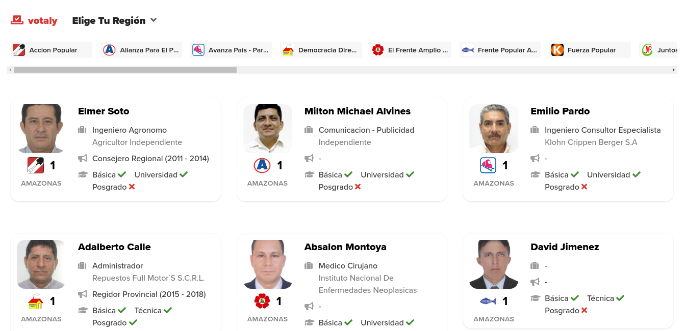
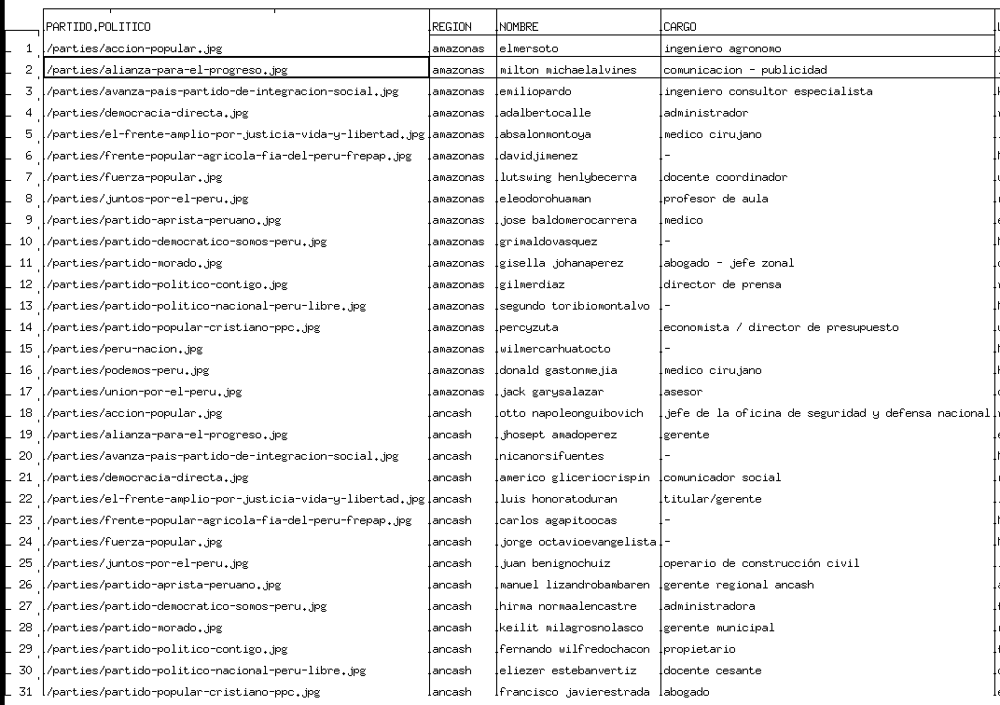

# beautifulsoup4: webscraping
> [**Click aquí para ir a la documentacion oficial**](https://pypi.org/project/beautifulsoup4 "dale click papu")

## instalación
```
$ pip3 install beautifulsoup4
```
## Links respecto a determinada clase
```py
 import requests
 response=requests.get('https://www.hackspace.pe/')
 import bs4
 soup = bs4.BeautifulSoup(response.text,'html.parser')
 links = soup.select('.description a')
 courses = [course['href'] for course in links]
 for course in courses:
 print(course)
```

## Extraer precio de un producto de la tienda Wong
```py
 import requests
 response=requests.get('https://www.wong.pe/fiddler-cooler-para-laptop-15-785296/p')
 import bs4
 soup = bs4.BeautifulSoup(response.text,'html.parser')
 links = soup.select('.skuBestPrice')
```

## Contar palabras de un discurso
1. `codigo.py`
	```py
	import urllib.request
	from bs4 import BeautifulSoup
	url = 'https://elpais.com/internacional/2018/01/31/actualidad/1517387619_036241.html'
	html = urllib.request.urlopen(url)
	soup2 = BeautifulSoup(html)
	tags = soup2('p')
	discurso = ''
	for tag in tags:
	    if(len(tag.attrs)) == 0:
		    a = tag.contents[0]
		    discurso = discurso + a

	print(discurso)
	contadores = dict()
	discurso = discurso.replace(',','').replace('.','').replace('?','').lower()
	palabras = discurso.split()
	for palabra in palabras:
	    contadores[palabra] = contadores.get(palabra,0) + 1

	remover= ('para', 'todo','sido','como','quién','ante','esta','de','del','la','y','el','en','a','que','mi','mis','al','los','lo','con','por','me','las','un','una','ha','han','se','si','no','voy','día','son','toda','o','muy','todos','qué','fui','he','cuando','estos','su','más','es','sus','nos','este','pero','le','ser','eso','solo','aqui','otros','aquí','están','está','entre','fue')
	for k in remover:
	    contadores.pop(k, None)

	import pandas
	b=pandas.DataFrame(list(contadores.items()),columns=['palabra','contador']).sort_values('contador',ascending=False)
	print(b.head(40))
	```
2. output  
	1. discurso   
		
	2. conteo de palabras  
		
## Fondo de inversion
1. `codigo`

	```py
	import urllib.request
	from bs4 import BeautifulSoup
	participaciones = 50
	url = 'http://www.morningstarfunds.ie/ie/funds/snapshot/snapshot.aspx?id=F00000PJME'
	html = urllib.request.urlopen(url)
	soup = BeautifulSoup(html)
	tags = soup.find_all("td",class_="line text")
	valor = tags[0]
	valor = float(valor.contents[0].replace('EUR\xa0',''))
	total = participaciones*valor
	print(total)
	```
2. output: 697.5

## Extraer data de politicos
1. Input
	
1. Codigo

	```py
	import requests
	response=requests.get('https://votaly.com/elecciones-2020-peru')
	import bs4
	soup = bs4.BeautifulSoup(response.text,'html.parser')
	import csv
	politico=['PARTIDO POLITICO','REGION','NOMBRE','CARGO','LUGAR DE TRABAJO']
	with open('archivo.csv', 'w') as file:
	    writer = csv.writer(file,dialect='excel')
	    writer.writerow(politico)
	    #Empieza el scrapeo eo eo 
	    datos = soup.select('a')
	    for dato in datos[23:59]:
		#partido politico
		div = dato.find("div", {"class": "flex justify-center leading-none"})
		a=str(div.select('img'))
		import re
		result = re.search('src="(.*)"/>',a)
		print('PARTIDO POLITICO: ',result.group(1))
		politico=[result.group(1)]
		#region
		div = dato.find("div", {"class": "text-sm"})
		print('REGION: ',div.contents[0])
		politico.append(re.search('\n            (.*)\n          ',str(div.contents[0])).group(1))
		#nombre
		div = dato.find("div", {"class": "card-title"})
		print('NOMBRE: ',div.contents[0])
		politico.append(str(div.contents[0]).replace("\n",' ').replace("             ",'').replace("           ",''))
		#cargo
		div = dato.find("div", {"class": "flex-1"})
		print('CARGO: ',div.contents[4].contents[2].contents[0].contents[0])
		cargo = str(div.contents[4].contents[2].contents[0].contents[0])
		politico.append(str(cargo).replace("\n",'').replace("                ",'').replace("              ",''))
		#lugar de trabajo
		div = dato.find("div", {"class": "capitalize text-gray-500"})
		if len(dir(div)) < 25:
		    lugarTrabajo='No encontrado'
		else:
		    lugarTrabajo=str(div.contents[0])
		print('LUGAR DE TRABAJO: ',lugarTrabajo)
		politico.append(str(lugarTrabajo).replace("\n",'').replace("                ",'').replace("              ",''))
		print(politico)
		writer.writerow(politico)

	```
2. output: **archivo.csv**  
	
