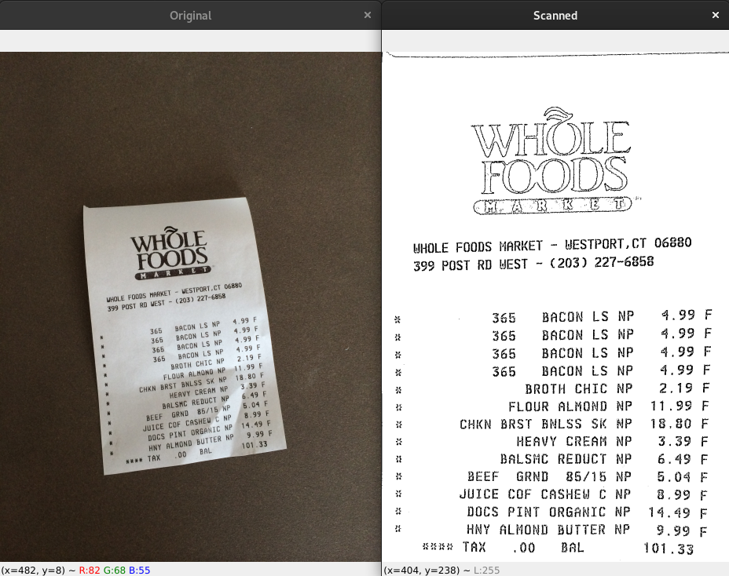
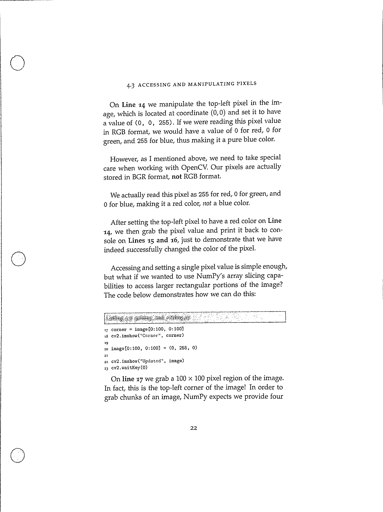
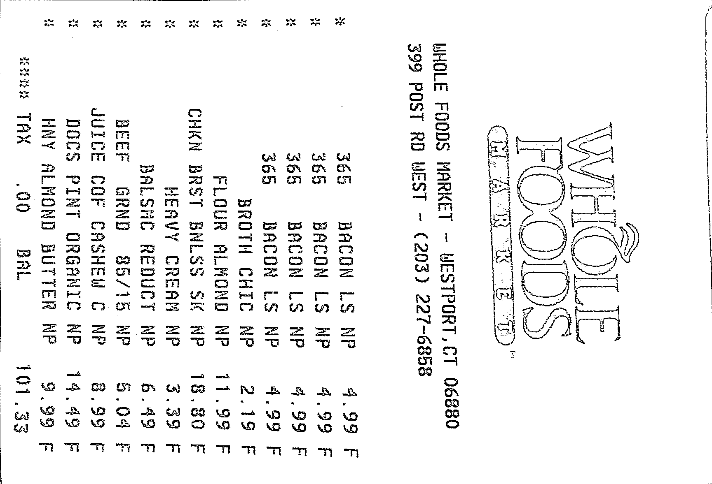

# Escanear documentos  
> [Link del post original](https://www.pyimagesearch.com/2014/09/01/build-kick-ass-mobile-document-scanner-just-5-minutes/)  


## Árbol de directorios de los archivos necesarios  
```
.
├── images
│   └── page.jpg
├── pyimagesearch
│   └── transform.py
└── scan.py
```
## Instalación  
1. Dependencias
	```
	$ sudo apt install libatlas-base-dev
	$ sudo apt install libatlas-doc liblapack-doc
	```
2. Instalamos pipenv (entorno virtual)  
	```
	$ sudo apt install pipenv
	```
2. Instalamos librerías  
	```
	$ pipenv install imutils
	$ pipenv install numpy
	$ pipenv install argparse
	$ pipenv install opencv-python
	$ pipenv install libopencv-dev
	$ pipenv install scikit-image
	```
3. Activar el entorno virtual  
	```
	$ pipenv shell
	```
## Ejecución  
```
$ python scan.py --image images/page.jpg
```
## Resultados 1  
1. Foto inicial: **page.jpg**    
	
2. Imagen resultante: **miImagen.png**   
	
## Resultados 2
1. Foto inicial: **page.jpg**    
	
2. Imagen resultante: **miImagen.png**   
	
