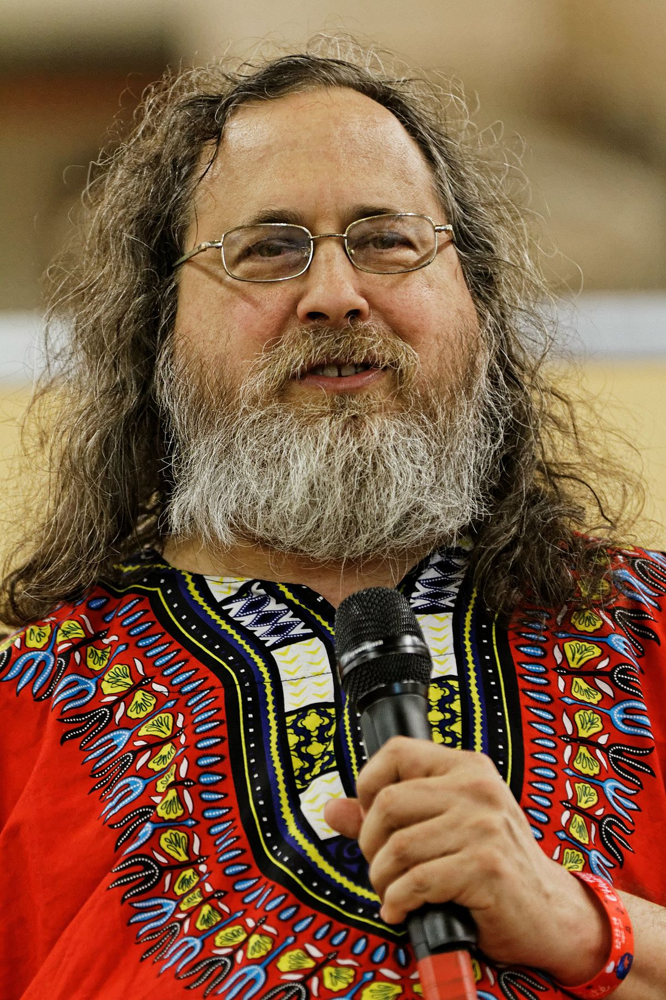

# FACE RECOGNITION
> [**Click aquí para ver la documentación original**](https://pypi.org/project/face-recognition/)


## Instalación
1. Usando un entorno virtual
	```
	$ pipenv install face-recognition
	```
2. Sin usar un entorno virtual
	```
	$ pip3 install face-recognition
	```
## Command line: usa 2 carpetas con fotos
1. Reconocer quien esta en una foto desconocida
	```
  	$ face_recognition carpetaConocidos carpetaDesconocidos
	```
2. Ajustar la tolerancia, sensibilidad(por defecto=0.6)
	```
	$ face_recognition --tolerance 0.54 ./pictures_of_people_i_know/ ./unknown_pictures/
	```
3. Mostrar que tan alejado en apariencia esta
	```
	$ face_recognition --show-distance true ./pictures_of_people_i_know/ ./unknown_pictures/
	```
4. Mostrar solo a quien de los conocidos a encontrado
	```
	$ face_recognition ./pictures_of_people_i_know/ ./unknown_pictures/ | cut -d ',' -f2
	```
5. Acelerar el face recognition
	1. Ver cuantos cores tieme mi cpu. me sale=2
		```
		$ nproc
		```
	2. Usar los 2 cores para acelerar el face recognition
		```
		$ face_recognition --cpus 2 ./pictures_of_people_i_know/ ./unknown_pictures/
		```
	3. Usar todos los cores del cpu
		```
		$ face_recognition --cpus -1 ./pictures_of_people_i_know/ ./unknown_pictures/
		```
## Ejemplos en Python
1. Obtener coordenadas de rostros
	1. Código  
		```python
		import face_recognition
		image = face_recognition.load_image_file("imagen.jpg")
		face_locations = face_recognition.face_locations(image)
		print(face_locations)
		```
	2. Imagen usada: **imagen.jpg**     
		
	3. Resultado  
		```
		[(68, 294, 175, 187)]
		```
2. Encerrar mediante un recuadro los rostros detectados
	1. Código  
		```py
		import cv2
		from PIL import Image
		import face_recognition
		image = face_recognition.load_image_file("foto.png")
		face_locations = face_recognition.face_locations(image)
		for (y1,x2,y2,x1) in face_locations:
		    cv2.rectangle(image,(x1,y1),(x2,y2),(0,0,255),2)
		    pil_image = Image.fromarray(image)
		pil_image.show()	
		```
	2. Imagen usada: **foto.png**  
		
	3. Resultado  
		
3. Encerrar en un recuadro a una persona especifica
	1. Código
		```py
		import face_recognition
		import cv2
		from PIL import Image
		me = face_recognition.load_image_file("elon.jpg")
		my_face_encoding = face_recognition.face_encodings(me)[0]
		unknown= face_recognition.load_image_file("objetivo.jpg")
		unknown_face_encoding = face_recognition.face_encodings(unknown)
		unknown_locations = face_recognition.face_locations(unknown)
		i=0
		for face_encoding in unknown_face_encoding:
		    match = face_recognition.compare_faces([my_face_encoding], face_encoding, tolerance=0.50)
		    print(match)
		    if match[0]:
			(y1,x2,y2,x1)=unknown_locations[i]
			cv2.rectangle(unknown,(x1,y1),(x2,y2),(0,0,255),2)
			pil_image = Image.fromarray(unknown)
			pil_image.show()
		    i+=1
		```
	2. Imagenes Input
		1. Imagen de la persona que queremos encontrar: **elon.jpg**  
			
		2. Imagen donde queremos buscar a la persona: **objetivo.jpg**  
			
	3. Output:    
		
2. Mostrar caras detectadas
	1. Código
		```py
		from PIL import Image
		import face_recognition
		# Load the jpg file into a numpy array
		image = face_recognition.load_image_file("foto.jpg")
		# Find all the faces in the image using the default HOG-based model.
		# This method is fairly accurate, but not as accurate as the CNN model and not GPU accelerated.
		# See also: find_faces_in_picture_cnn.py
		face_locations = face_recognition.face_locations(image)
		print("I found {} face(s) in this photograph.".format(len(face_locations)))
		for face_location in face_locations:
		    # Print the location of each face in this image
		    top, right, bottom, left = face_location
		    print("A face is located at pixel location Top: {}, Left: {}, Bottom: {}, Right: {}".format(top, left, bottom, right))
		    # You can access the actual face itself like this:
		    face_image = image[top:bottom, left:right]
		    pil_image = Image.fromarray(face_image)
		    pil_image.save("output.png")
		    pil_image.show()
		```
	2. Imagen usada: **foto.jpg**     
		
	3. Resultado: **output.png**     
		
3. Características faciales
	1. Código
		```python
		from PIL import Image, ImageDraw
		import face_recognition
		# Load the jpg file into a numpy array
		image = face_recognition.load_image_file("foto.jpg")
		# Find all facial features in all the faces in the image
		face_landmarks_list = face_recognition.face_landmarks(image)
		print("I found {} face(s) in this photograph.".format(len(face_landmarks_list)))
		# Create a PIL imagedraw object so we can draw on the picture
		pil_image = Image.fromarray(image)
		d = ImageDraw.Draw(pil_image)
		for face_landmarks in face_landmarks_list:
		    # Print the location of each facial feature in this image
		    for facial_feature in face_landmarks.keys():
			print("The {} in this face has the following points: {}".format(facial_feature, face_landmarks[facial_feature]))
		    # Let's trace out each facial feature in the image with a line!
		    for facial_feature in face_landmarks.keys():
			d.line(face_landmarks[facial_feature], width=5)
		# Show the picture
		pil_image.show()
		pil_image.save("output.png")
		```
	2. Imagen usada: **foto.jpg**      
		
	3. Resultado: **output.png**    
		
4. Identificar si a partir de una foto, ver en otra si aparezco o no
	1. Código   
		```python
		import face_recognition
		picture_of_me = face_recognition.load_image_file("yo.jpg")
		my_face_encoding = face_recognition.face_encodings(picture_of_me)[0]
		unknown_picture = face_recognition.load_image_file("foto.jpg")
		unknown_face_encoding = face_recognition.face_encodings(unknown_picture)[0]
		results = face_recognition.compare_faces([my_face_encoding], unknown_face_encoding)
		if results[0] == True:
		    print("It's a picture of me!")
		else:
		    print("It's not a picture of me!")
		```
	2. Mi foto: **yo.jpg**      
		
	3. Foto donde haré la consulta si aparezco o no: **foto.jpg**    
		
	4. Resultado   
		```
		It's a picture of me!
		```
## Ejemplo en una Raspberry Pi con una Picamera
1. Conectamos la picamera a la Raspberry Pi  
	
2. Instalación
	```
	$ pip3 install opencv-python 
	$ pip3 install face-recognition
	$ pip3 install picamera 
	```
3. Código: `codigo.py`
	```python
	import face_recognition
	import picamera
	import numpy as np
	camera = picamera.PiCamera()
	camera.resolution = (320, 240)
	output = np.empty((240, 320, 3), dtype=np.uint8)
	# Load a sample picture and learn how to recognize it.
	print("Loading known face image(s)")
	obama_image = face_recognition.load_image_file("modelos/obama.jpg")
	obama_face_encoding = face_recognition.face_encodings(obama_image)[0]
	biden_image = face_recognition.load_image_file("modelos/biden.jpg")
	biden_face_encoding = face_recognition.face_encodings(biden_image)[0]
	stallman_image= face_recognition.load_image_file("modelos/richard.jpg")
	stallman_face_encoding = face_recognition.face_encodings(stallman_image)[0]
	chupetin_image= face_recognition.load_image_file("modelos/chupetin.jpg")
	chupetin_face_encoding = face_recognition.face_encodings(chupetin_image)[0]
	known_face_encodings = [obama_face_encoding,biden_face_encoding,stallman_face_encoding,chupetin_face_encoding]
	# Initialize some variables
	face_locations = []
	face_encodings = []
	known_face_names = [
	    "Barack Obama",
	    "Joe Biden",
	    "Richard Stallman",
	    "Chupetin Trujillo"
	]
	while True:
	    print("Capturando imagen.")
	    # Grab a single frame of video from the RPi camera as a numpy array
	    camera.capture(output, format="rgb")
	    # Find all the faces and face encodings in the current frame of video
	    face_locations = face_recognition.face_locations(output)
	    print("Encontradas {} caras en la imagen.".format(len(face_locations)))
	    face_encodings = face_recognition.face_encodings(output, face_locations)
	    # Loop over each face found in the frame to see if it's someone we know.
	    face_names = []
	    for face_encoding in face_encodings:
		# See if the face is a match for the known face(s)
		#match = face_recognition.compare_faces([obama_face_encoding], face_encoding)
		match = face_recognition.compare_faces(known_face_encodings, face_encoding)
		name = "Persona Desconocida"
		face_distances = face_recognition.face_distance(known_face_encodings, face_encoding)
		best_match_index = np.argmin(face_distances)
		if match[best_match_index]:
		    name = known_face_names[best_match_index]
		    print("PERSONA DETECTADA: ",name)
		#face_names.append(name)
	```
4. Ejecución
	1. Ejecutamos
		```
		$ python codigo.py
		```
	2. Enfocamos la cámara en la cara de la persona o foto
5. Pruebas:
	1. Richard Stallman
		1. Imagen modelo  
			
		2. Imagen enfocada con la cámara   
			
		3. Output  
			
	2. Chupetin Trujillo
		1. Imagen modelo  
			
		2. Imagen enfocada con la cámara  
			
		3. Output  
			
