# Titanic: Machine Learning from Disaster
**Start here! Predict survival on the Titanic and get familiar with ML basics**    

## Instalación
```
$ pip3 install pycaret
```

## Descargamos
1. Entramos a: **https://www.kaggle.com/c/titanic**  
	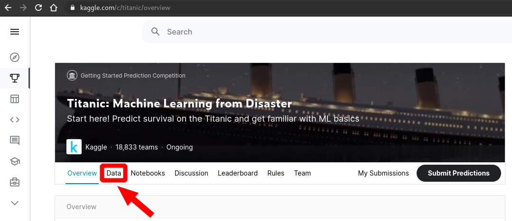  
2. Descargamos  
	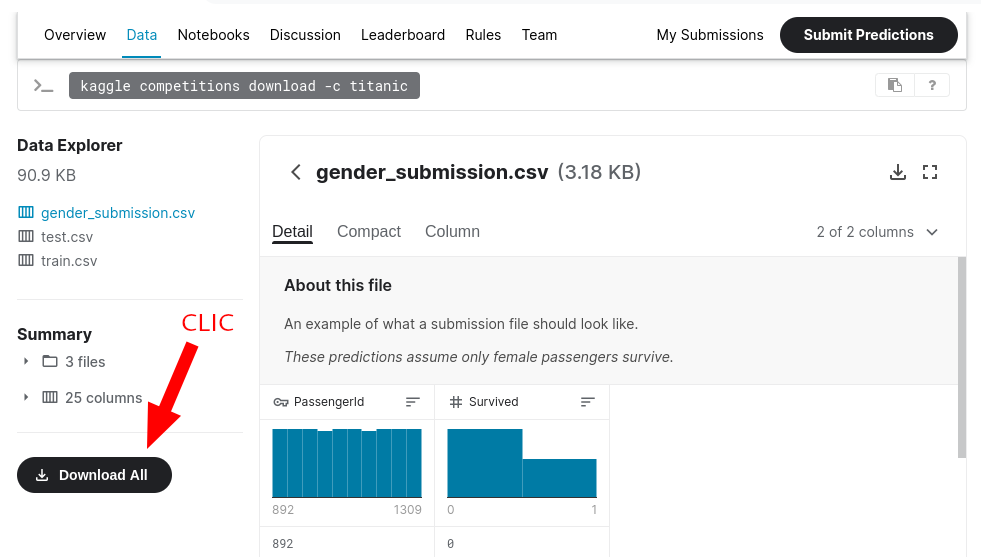  
3. Descomprimos  
	```
	$ unzip titanic.zip
	```
4. Tendremos la carpeta "titanic" que contiene:
	```
	titanic
	├── gender_submission.csv
	├── test.csv
	└── train.csv
	```
## Ejecución en Debian (Gnu/Linux)
> [**Clic aquí para ver un video guía**](https://www.youtube.com/watch?v=nqMM6rngNCA)

1. **STEP 1: Setup the environment**
	1. Iniciamos python
		```
		$ python
		```
	2. Importamos y vemos las primeras líneas de: `train.csv`
		```py
		import numpy as np # linear algebra
		import pandas as pd # data processing, CSV file I/O
		data = pd.read_csv('titanic/train.csv')
		data.head()
		```
		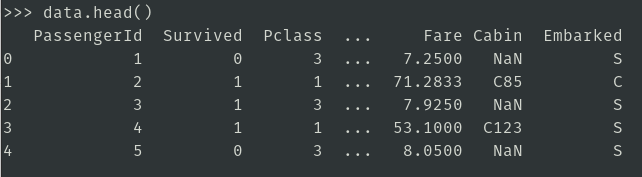
	3. Setting up environment in pycaret
		```py
		import pycaret
		from pycaret.classification import *
		clf1 = setup(data,target='Survived',ignore_features=['Name','Ticket','PassengerId'])
		```
		1. Verificamos el Data Types y presionamos: Enter  
			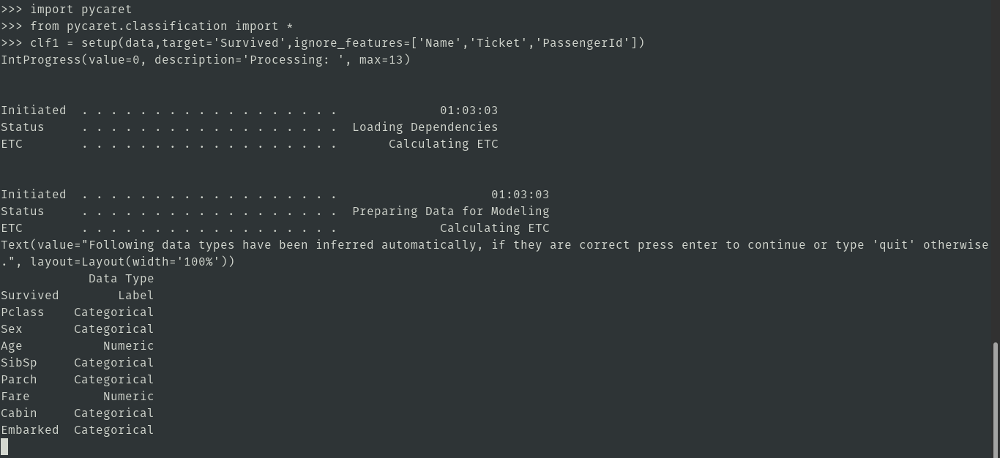
		2. Finalmente nos sale  
			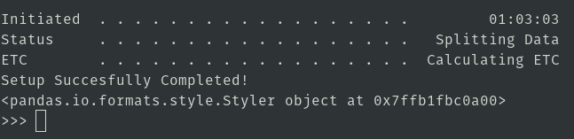
2. **STEP 2: Comparing All Models**  
Compare models train all models in library and evaluate metrics on K-Fold cross validation  
	1. compare
		```py
		best_model = compare_models(verbose = False)
		print(best_model)
		```
		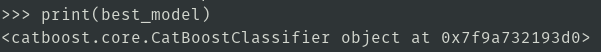
	2. models
		```py
		models()
		```
		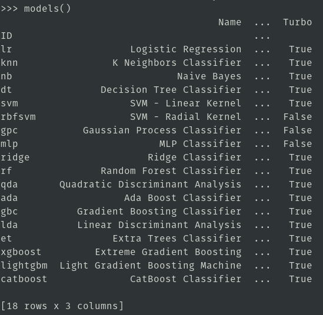
3. **STEP 3: Create a Model**
	1. Random forest classifier
		```py
		rf = create_model('rf',verbose=False)
		print(rf)
		```
		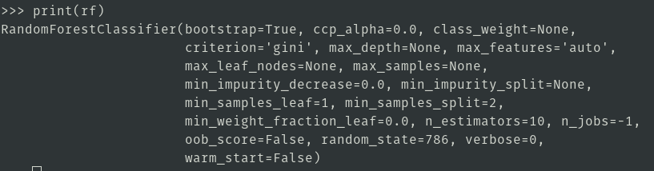
4. **STEP 4: tunning a model**
	1. Random forest classifier
		```py
		tuned_rf = tune_model(rf,verbose=False)
		print(tuned_rf)
		```
		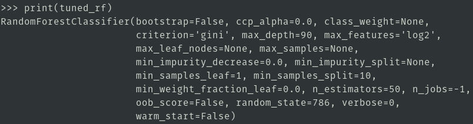
5. **STEP 5: plot a model**
	1. plot a model: auc plot
		```py
		plot_model(tuned_rf, plot = 'auc')
		```
		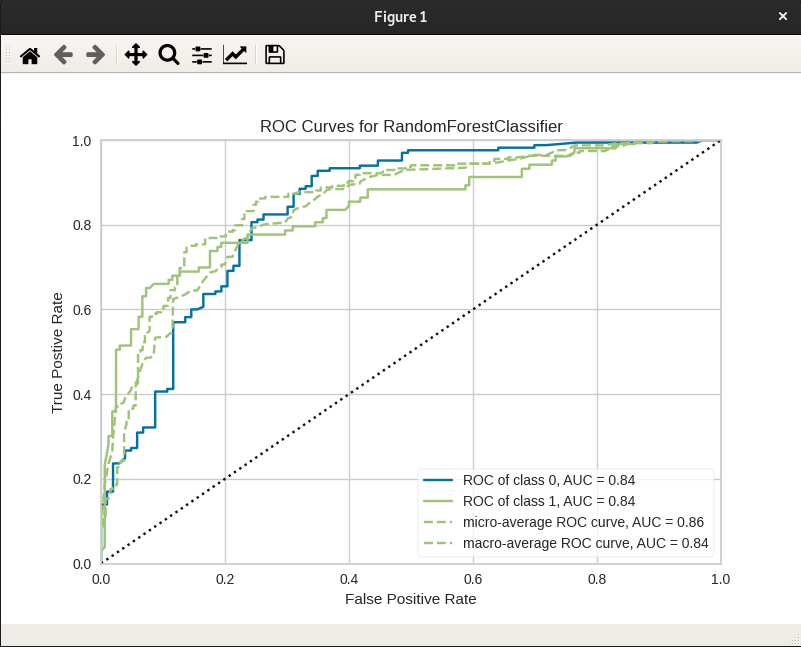
	2. plot a model: precision-recall curve
		```py
		plot_model(tuned_rf, plot = 'pr')
		```
		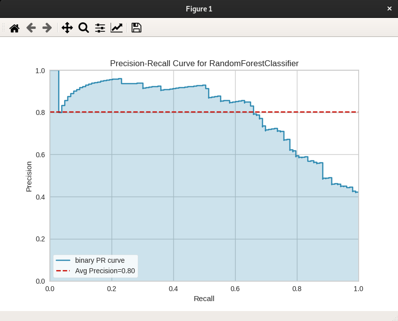
	3. plot a model: feature importance plot
		```py
		plot_model(tuned_rf, plot='feature')
		```
		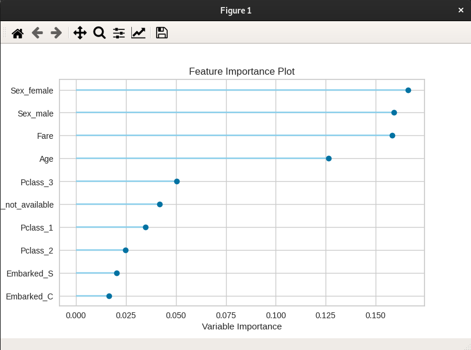
	4. plot a model: confusion matrix
		```py
		plot_model(tuned_rf, plot = 'confusion_matrix')
		```
		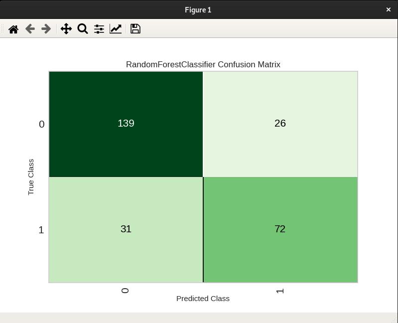
	5. all available plots
		```py
		evaluate_model(tuned_rf)
		```
		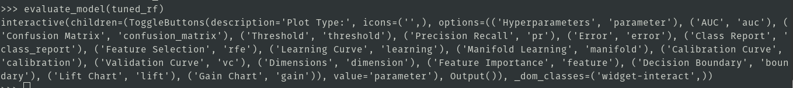
6. **STEP 6: predict test data**  
	1. predict on test/hold-out sample
		```py
		predict_model(tuned_rf);
		```
		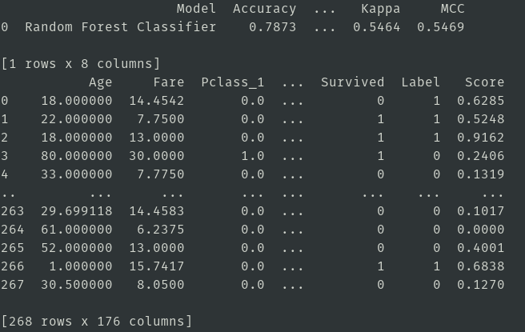
	2. finalize model for deployment
		```py
		final_rf = finalize_model(tuned_rf)
		print(final_rf)
		```
		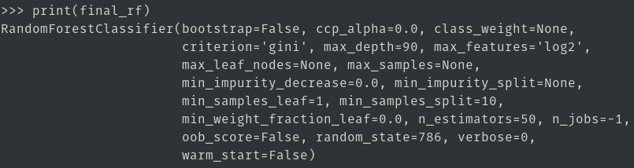
		```py
		predict_model(final_rf);
		```
		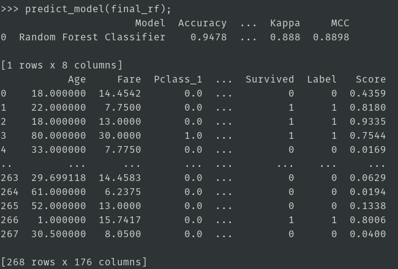
	3. predict on unseen data
		```py
		data_unseen = pd.read_csv('titanic/test.csv')
		data_unseen.head()
		```
		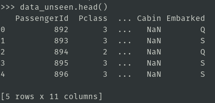
		```py
		unseen_predictions = predict_model(final_rf, data=data_unseen)
		unseen_predictions.head()
		```
		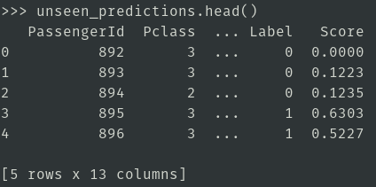
	4. saving the model: Se guarda como `Final RF Model 12Set2020.pkl`
		```py
		save_model(final_rf,'Final RF Model 12Set2020')
		```
		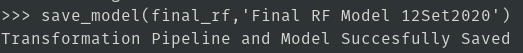
	5. loading the saved model
		```py
		saved_final_rf = load_model('Final RF Model 12Set2020')
		new_prediction = predict_model(saved_final_rf, data=data_unseen)
		new_prediction.head()
		```
		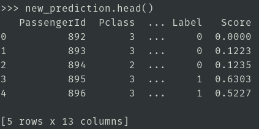
