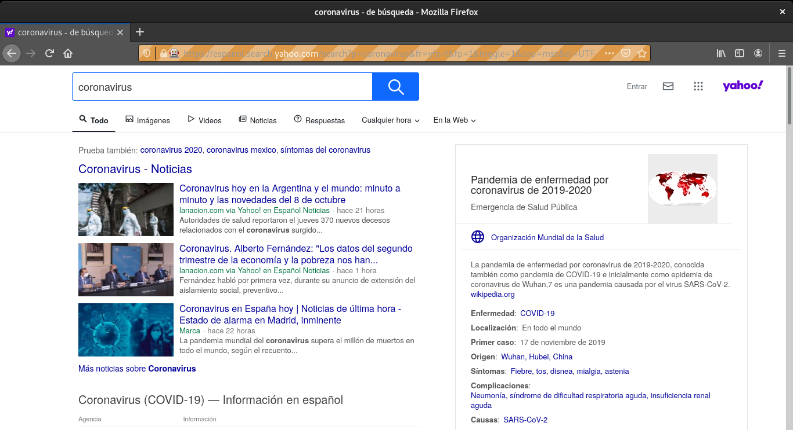
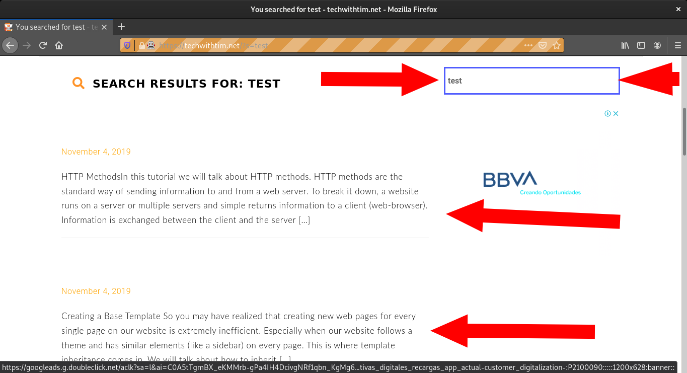
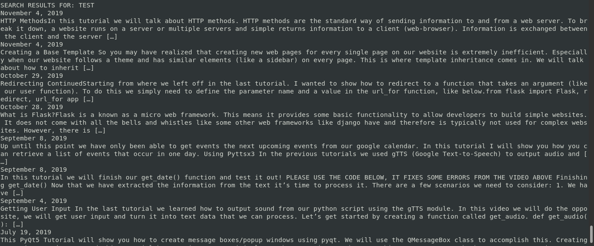
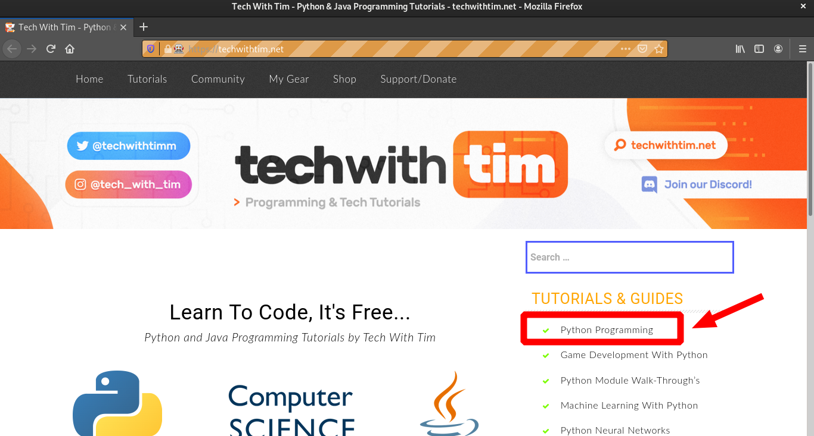
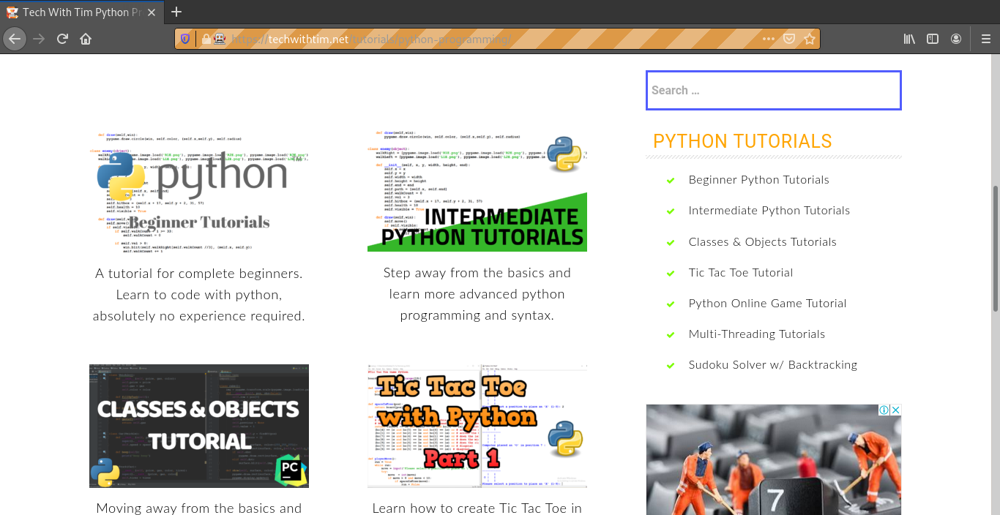
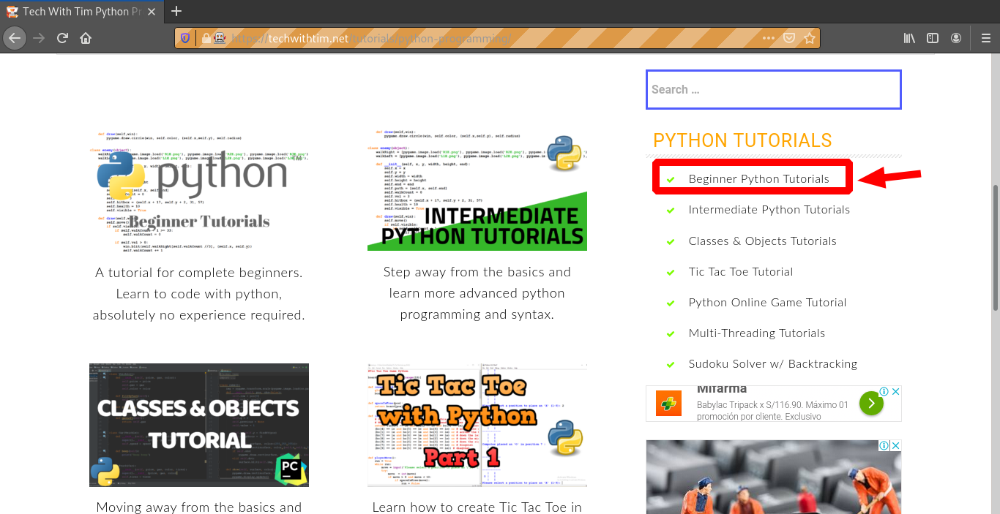
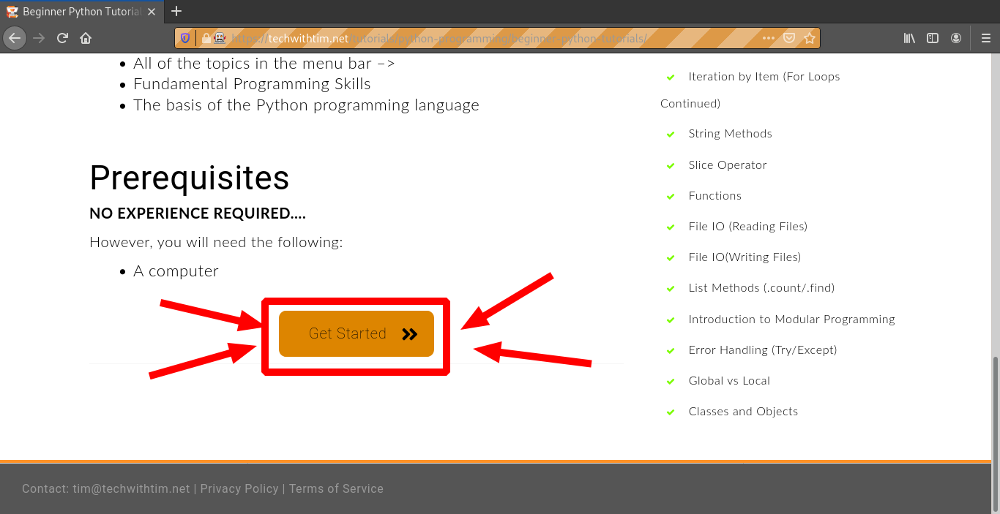
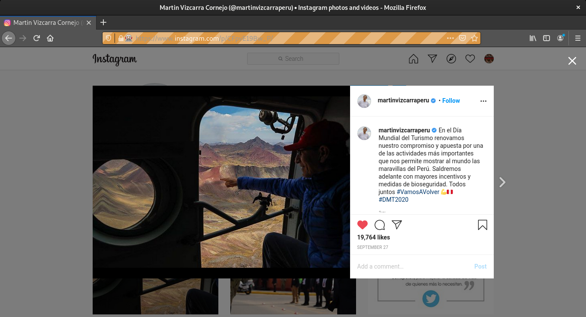

# Selenium
> [pypi.org/project/selenium/](https://pypi.org/project/selenium/ "Dale click papu")  
> [selenium-python.readthedocs.io](https://selenium-python.readthedocs.io/ "Dale click papu")  


## Instalación
1. selenium
	```
	$ pip3 install selenium
	```
2. drivers
	1. descargamos los drivers dependiendo el navegador
		1. [chrome](https://chromedriver.chromium.org/downloads)
		2. [edge](https://developer.microsoft.com/en-us/microsoft-edge/tools/webdriver/)
		3. [firefox](https://github.com/mozilla/geckodriver/releases)
		4. [safari](https://webkit.org/blog/6900/webdriver-support-in-safari-10/)
	2. descomprimimos
		```
		$ tar -xvzf geckodriver-v0.27.0-linux64.tar.gz
		```
	3. movemos
		1. aqui
			```
			$ mv geckodriver /usr/bin/
			```
		2. o aqui
			```
			$ mv geckodriver /usr/local/bin/
			```
## Abrir una página
1. `codigo.py`
	```py
	from selenium import webdriver
	browser = webdriver.Firefox(firefox_binary="/usr/bin/firefox-esr")
	browser.get('https://www.nasa.gov/')
	print(browser.title)
	```
2. Output
	
## Usar el buscador de yahoo
1. `codigo.py`
	```py
	from selenium import webdriver
	from selenium.webdriver.common.keys import Keys
	browser = webdriver.Firefox(firefox_binary="/usr/bin/firefox-esr")
	browser.get('http://www.yahoo.com')
	assert 'Yahoo' in browser.title
	elem = browser.find_element_by_name('p')  # Find the search box
	elem.send_keys('coronavirus' + Keys.RETURN)
	```
2. Output
	
## extraer texto de articulos luego de una busqueda
1. `codigo.py`
	```py
	from selenium import webdriver
	from selenium.webdriver.common.keys import Keys
	from selenium.webdriver.common.by import By
	from selenium.webdriver.support.ui import WebDriverWait
	from selenium.webdriver.support import expected_conditions as EC
	import time
	browser = webdriver.Firefox(firefox_binary="/usr/bin/firefox-esr")
	browser.get('https://techwithtim.net')
	search=browser.find_element_by_name("s")
	search.send_keys("test")
	search.send_keys(Keys.RETURN)
	try:
	    main=WebDriverWait(browser,10).until(EC.presence_of_element_located((By.ID,"main")))
	    print(main.text)
	except:
	    browser.quit()
	```
2. Output
	
	
## clicking simple (click a link de texto)
1. `codigo.py`
	```py
	from selenium import webdriver
	browser = webdriver.Firefox(firefox_binary="/usr/bin/firefox-esr")
	browser.get('https://techwithtim.net')
	link=browser.find_element_by_link_text("Python Programming")
	link.click()
	browser.back()
	browser.forward()
	```
2. Output
	
	
## clicking consecutivo (2 click en texto, 1 click en boton)
1. `codigo.py`
	```py
	from selenium import webdriver
	from selenium.webdriver.support.ui import WebDriverWait
	from selenium.webdriver.support import expected_conditions as EC
	from selenium.webdriver.common.by import By
	browser = webdriver.Firefox(firefox_binary="/usr/bin/firefox-esr")
	browser.get('https://techwithtim.net')
	link=browser.find_element_by_link_text("Python Programming")
	link.click()
	try:
	    element=WebDriverWait(browser,10).until(EC.presence_of_element_located((By.LINK_TEXT,"Beginner Python Tutorials")))
	    element.click()
	    element=WebDriverWait(browser,10).until(EC.presence_of_element_located((By.ID,"sow-button-19310003")))
	    element.click()
	except:
	    browser.quit()
	```
2. Output
	
	
	
## Dándole like a las fotos de instagram del tio Vizcarri
1. `codigo.py`
	```py
	from selenium import webdriver
	import time
	username='lilberick'
	password='Lapassword'
	browser = webdriver.Firefox(firefox_binary="/usr/bin/firefox-esr")
	browser.get('https://www.instagram.com/martinvizcarraperu/')

	def login(username, password): 
		# finds the login button and click 
		log_but = browser.find_element_by_class_name("L3NKy")
		time.sleep(2) 
		log_but.click()
		time.sleep(4)
		# finds the username box 
		usern = browser.find_element_by_name("username") 
		usern.send_keys(username)
		# finds the password box 
		passw = browser.find_element_by_name("password")
		passw.send_keys(password)
		# finds the login button 
		log_cl = browser.find_element_by_css_selector('button[type=submit]').click()
		time.sleep(4) 
		NotNow = browser.find_element_by_class_name("yWX7d")
		NotNow.click()

	def first_picture(): 
		pic = browser.find_element_by_class_name("_9AhH0")
		pic.click()

	def like_pic(): 
		time.sleep(4) 
		like = browser.find_element_by_xpath('/html/body/div[4]/div[2]/div/article/div[3]/section[1]/span[1]/button/div/span')
		time.sleep(2) 
		like.click()   
	def next_picture(): 
		time.sleep(2) 
		nex = browser.find_element_by_class_name("coreSpriteRightPaginationArrow")   
		time.sleep(1) 
		return nex
	def continue_liking(): 
		while(True): 
			next_el = next_picture()
			if next_el != False:   
				# click the next button 
				next_el.click()    
				time.sleep(2) 
				# like the picture 
				like_pic()     
				time.sleep(2)             
			else: 
				print("not found")  
				break

	login(username,password)
	first_picture()
	like_pic()
	continue_liking()
	```
2. Output
	
