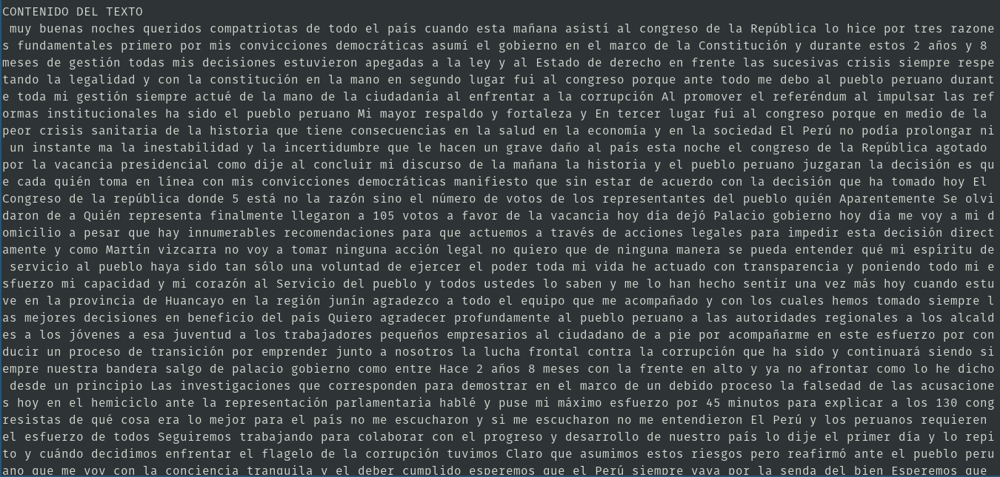
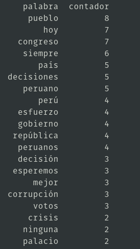
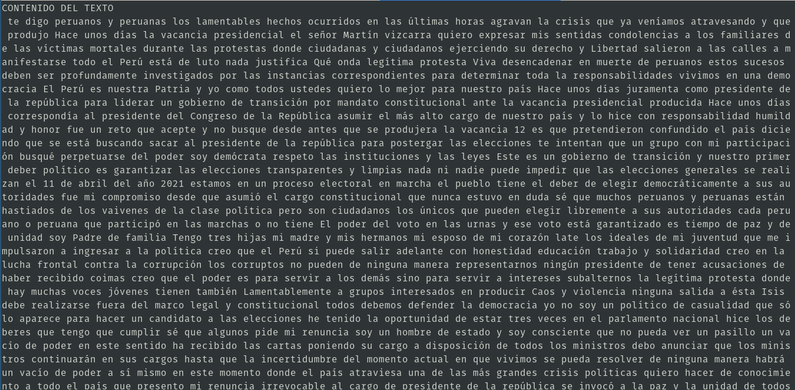
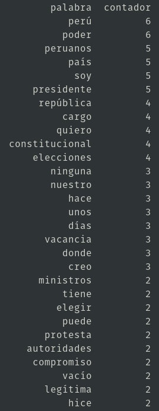

# sentiment-analysis
> **[Click aqui para acceder a la documentacion original](https://pypi.org/project/sentiment-analysis-spanish/)**  


## instalacion
```
$ pip3 install sentiment-analysis-spanish
$ pip3 install keras 
$ pip3 install tensorflow
```

## Conteo de palabras y analisis de sentimientos: Discurso de la vacancia del Presidente Vizcarra
1. Input: [VacanciaVizcarra.wav](.img/VacanciaVizcarra.wav)
2. `codigo.py`

	```py
	import os
	os.system('/usr/bin/ffmpeg -i VacanciaVizcarra.wav -c copy -map 0 -segment_time 00:05:00 -f segment output%03d.wav')
	import glob
	print(glob.glob("output*.wav"))
	a=glob.glob("output*.wav")
	texto=''
	for i in range(len(a)):
	    print(a[i])
	    #audio_to_text():
	    import speech_recognition as sr
	    r = sr.Recognizer()
	    audio=a[i]
	    with sr.AudioFile(audio) as source:
		audio = r.record(source)
		print('Done!')
	    try:    
		text = r.recognize_google(audio,language='es-PE')
	    except Exception as e:
		print(e)
	    texto=texto+" "+text

	print("CONTENIDO DEL TEXTO")
	print(texto)
	#Guardar texto
	with open("texto.txt", "w") as f:
	    f.write(texto)
	#Conteo de palabras
	contadores = dict()
	texto = texto.replace(',','').replace('.','').replace('?','').lower()
	palabras = texto.split()
	for palabra in palabras:
	    contadores[palabra]=contadores.get(palabra,0)+1

	remover= ('para', 'todo','sido','como','quién','ante','esta','de','del','la','y','el','en','a','que','mi','mis','al','los','lo','con','por','me','las','un','una','ha','han','se','si','no','voy','día','son','toda','o','muy','todos','qué','fui','he','cuando','estos','su','más','es','sus','nos','este','pero','le','ser','eso','solo','aqui','otros','aquí','están','está','entre','fue')
	for k in remover:
	    contadores.pop(k, None)

	import pandas
	b=pandas.DataFrame(list(contadores.items()),columns=['palabra','contador']).sort_values('contador',ascending=False)
	print(b.head(30))
	#Analisis de sentimientos
	from sentiment_analysis_spanish import sentiment_analysis
	sentiment = sentiment_analysis.SentimentAnalysisSpanish()
	print('ANALISIS DE SENTIMIENTOS: ',sentiment.sentiment(texto))
	```
3. Output  
	1. Contenido de texto   
		  
	2. Contador de palabras  
		  
	3. ANALISIS DE SENTIMIENTOS (0=negativo, 0.5=neutro, 1=positivo):  **9.358644e-17**  
		
## Conteo de palabras y analisis de sentimientos: Discurso de la renuncia del Presidente Merino
1. Input: [RenunciaMerino.wav](.img/RenunciaMerino.wav)
2. `codigo.py`

	```py
	import os
	os.system('/usr/bin/ffmpeg -i RenunciaMerino.wav -c copy -map 0 -segment_time 00:05:00 -f segment output%03d.wav')
	import glob
	print(glob.glob("output*.wav"))
	a=glob.glob("output*.wav")
	texto=''
	for i in range(len(a)):
	    print(a[i])
	    #audio_to_text():
	    import speech_recognition as sr
	    r = sr.Recognizer()
	    audio=a[i]
	    with sr.AudioFile(audio) as source:
		audio = r.record(source)
		print('Done!')
	    try:    
		text = r.recognize_google(audio,language='es-PE')
	    except Exception as e:
		print(e)
	    texto=texto+" "+text

	print("CONTENIDO DEL TEXTO")
	print(texto)
	#Guardar texto
	with open("texto.txt", "w") as f:
	    f.write(texto)
	#Conteo de palabras
	contadores = dict()
	texto = texto.replace(',','').replace('.','').replace('?','').lower()
	palabras = texto.split()
	for palabra in palabras:
	    contadores[palabra]=contadores.get(palabra,0)+1

	remover= ('para', 'todo','sido','como','quién','ante','esta','de','del','la','y','el','en','a','que','mi','mis','al','los','lo','con','por','me','las','un','una','ha','han','se','si','no','voy','día','son','toda','o','muy','todos','qué','fui','he','cuando','estos','su','más','es','sus','nos','este','pero','le','ser','eso','solo','aqui','otros','aquí','están','está','entre','fue')
	for k in remover:
	    contadores.pop(k, None)

	import pandas
	b=pandas.DataFrame(list(contadores.items()),columns=['palabra','contador']).sort_values('contador',ascending=False)
	print(b.head(30))
	#Analisis de sentimientos
	from sentiment_analysis_spanish import sentiment_analysis
	sentiment = sentiment_analysis.SentimentAnalysisSpanish()
	print('ANALISIS DE SENTIMIENTOS: ',sentiment.sentiment(texto))
	```
3. Output  
	1. Contenido de texto  
		  
	2. Contador de palabras  
		    
	3. ANALISIS DE SENTIMIENTOS (0=negativo, 0.5=neutro, 1=positivo):  **2.2462973e-17**
